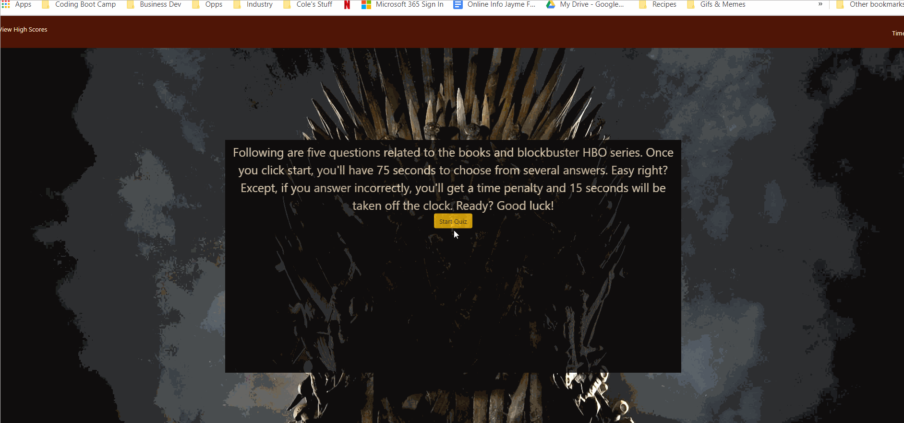

### Game of Thrones Quiz

This is an interactive designed to test your knowledge of the blockbuster HBO series "Game of Thrones."  Once you click start, you'll have 75 seconds to choose from several answers.  If you answer incorrectly, you'll get a time penalty and 15 seconds will be taken off the clock.

## Contents | Quick Links
[Getting Started](#start)     |     [Demo](#demo)     |     [Built With](#built)     |     [Authors](#author)     |     [Visuals](#visuals)     |     [Contributing & Tests](Contributing.md)     |     [Contact](#contact)

## [Getting Started](#start)

### Download the app from Git Hub here:
* [Repo URL](https://github.com/JenJayme/quiz-game)

### <a id="demo">View a demo:</a> 
* [Deployed on GitHub Page](https://jenjayme.github.io/quiz-game/#demo)

## [Visuals](#visuals)

## <a id="built">Built With</a>
* HTML5 & CSS
* [Javascript](https://www.javascript.com/)
* [Bootstrap](https://getbootstrap.com/)
* [VS Code](https://code.visualstudio.com/)
* [Node.js](https://nodejs.org/)

## <a id="contact">Questions</a>
For questions or to discuss collaborations on this or other projects, contact the author via LinkedIn or GitHub as follows.

## <a id="author">Author</a>

**Jen Jayme** 
[linkedin.com/jenjayme](https://www.linkedin.com/in/jenjayme) 
[github.com/jenjayme](https://github.com/JenJayme)

## Acknowledgements
* Special thanks to Jerome Chenette, UC Berkeley Coding Boot Camp and Trilogy Education Services for referring this project.
* Shout out to Fred Rodolfo for critical advice and support.